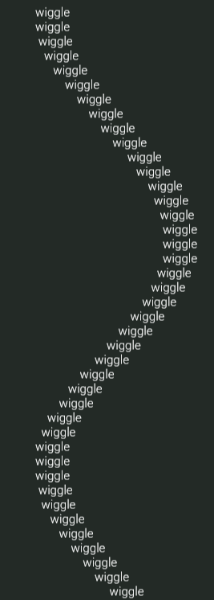
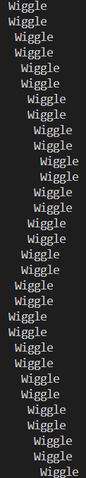

# Wiggle

Have you ever wanted to create a long wave of text like this : 



## Usage Instructions
1. Clone a copy of the repository to your system with 
   ```git clone https://github.com/AS-Nath/wiggle```.

2. Modify the source yourself to select the parameters of the wiggle text that you would like (word, number of waves, length of wave). You can recompile the source and run accordingly.

*To simply test the code, run* ```./a.out``` *to execute the included Windows 64-bit executable.*



Enjoy wiggling!